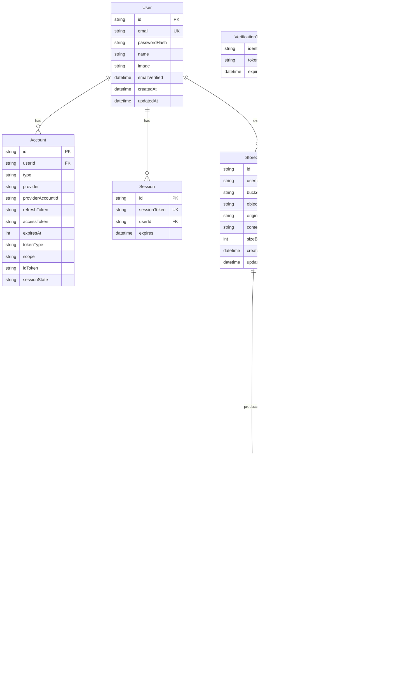
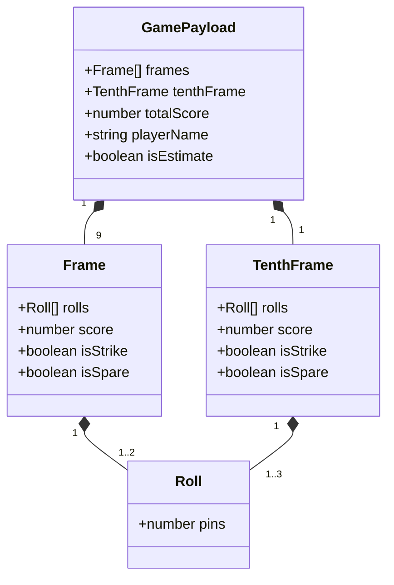

# Data Model

This document describes the persisted data model in Prisma/Postgres and the JSON shape stored inside bowling score records.

## Relational Model

## Bowling Score JSON Payload

`BowlingScore.frames` stores frames 1 through 9 as JSON. `BowlingScore.tenthFrame` stores frame 10 separately.

## Notes

- `StoredImage` is the root record for one uploaded scorecard image stored in object storage.
- `BowlingScore` keeps one row per parsed game variant. The `(storedImageId, gameIndex, isEstimate)` unique key allows both estimated and corrected versions of the same game index.
- `LLMRequest.status` is currently used as a free-form string, but the code path uses `queued`, `pending`, `succeeded`, and `failed`.
- `BowlingScore.llmRequestId` is nullable because manually corrected scores can outlive or detach from the generating request.
- `StoredImage` API responses expose derived fields such as `previewUrl`, `isProcessingEstimate`, and `lastEstimateError`; those are serializer outputs, not database columns.
