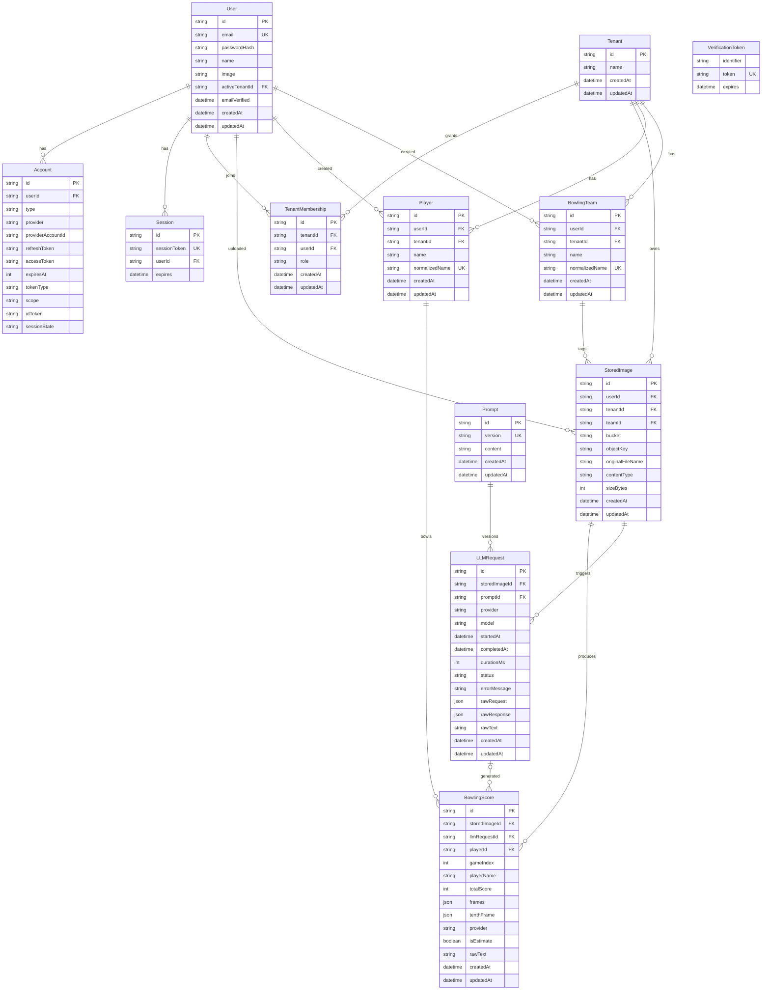
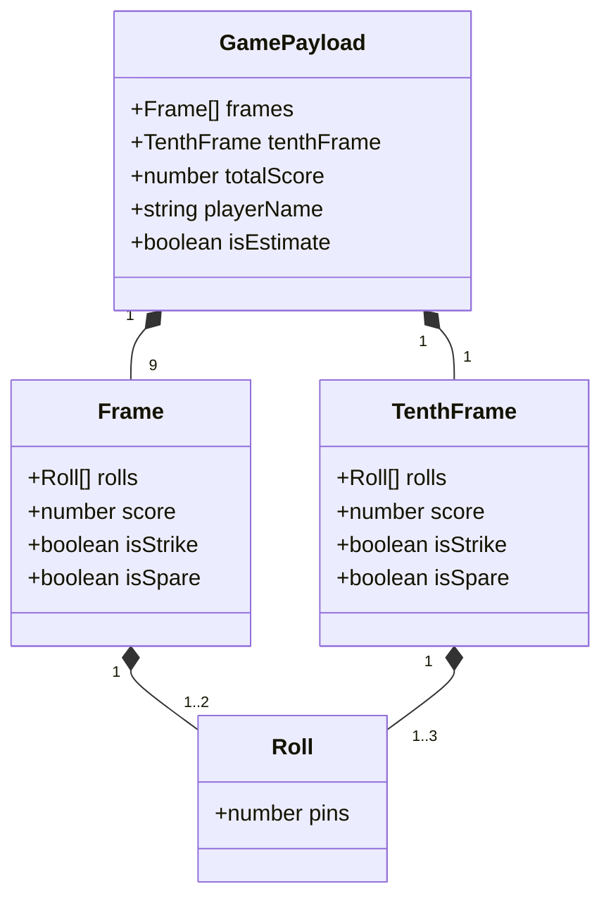

# Data Model

This document describes the persisted data model in Prisma/Postgres and the JSON shape stored inside bowling score records.

## Relational Model

```mermaid
erDiagram
    User {
        string id PK
        string email UK
        string passwordHash
        string name
        string image
        string activeTenantId FK
        datetime emailVerified
        datetime createdAt
        datetime updatedAt
    }

    Tenant {
        string id PK
        string name
        datetime createdAt
        datetime updatedAt
    }

    TenantMembership {
        string id PK
        string tenantId FK
        string userId FK
        string role
        datetime createdAt
        datetime updatedAt
    }

    Account {
        string id PK
        string userId FK
        string type
        string provider
        string providerAccountId
        string refreshToken
        string accessToken
        int expiresAt
        string tokenType
        string scope
        string idToken
        string sessionState
    }

    Session {
        string id PK
        string sessionToken UK
        string userId FK
        datetime expires
    }

    VerificationToken {
        string identifier
        string token UK
        datetime expires
    }

    StoredImage {
        string id PK
        string userId FK
        string tenantId FK
        string teamId FK
        string bucket
        string objectKey
        string originalFileName
        string contentType
        int sizeBytes
        datetime createdAt
        datetime updatedAt
    }

    Player {
        string id PK
        string userId FK
        string tenantId FK
        string name
        string normalizedName UK
        datetime createdAt
        datetime updatedAt
    }

    BowlingTeam {
        string id PK
        string userId FK
        string tenantId FK
        string name
        string normalizedName UK
        datetime createdAt
        datetime updatedAt
    }

    BowlingScore {
        string id PK
        string storedImageId FK
        string llmRequestId FK
        string playerId FK
        int gameIndex
        string playerName
        int totalScore
        json frames
        json tenthFrame
        string provider
        boolean isEstimate
        string rawText
        datetime createdAt
        datetime updatedAt
    }

    LLMRequest {
        string id PK
        string storedImageId FK
        string promptId FK
        string provider
        string model
        datetime startedAt
        datetime completedAt
        int durationMs
        string status
        string errorMessage
        json rawRequest
        json rawResponse
        string rawText
        datetime createdAt
        datetime updatedAt
    }

    Prompt {
        string id PK
        string version UK
        string content
        datetime createdAt
        datetime updatedAt
    }

    User ||--o{ Account : has
    User ||--o{ Session : has
    User ||--o{ TenantMembership : joins
    Tenant ||--o{ TenantMembership : grants
    Tenant ||--o{ StoredImage : owns
    Tenant ||--o{ Player : has
    Tenant ||--o{ BowlingTeam : has
    User ||--o{ StoredImage : uploaded
    User ||--o{ Player : created
    User ||--o{ BowlingTeam : created
    BowlingTeam ||--o{ StoredImage : tags
    StoredImage ||--o{ BowlingScore : produces
    Player ||--o{ BowlingScore : bowls
    StoredImage ||--o{ LLMRequest : triggers
    Prompt ||--o{ LLMRequest : versions
    LLMRequest o|--o{ BowlingScore : generated
```

## Bowling Score JSON Payload

`BowlingScore.frames` stores frames 1 through 9 as JSON. `BowlingScore.tenthFrame` stores frame 10 separately.

```mermaid
classDiagram
    class Roll {
      +number pins
    }

    class Frame {
      +Roll[] rolls
      +number score
      +boolean isStrike
      +boolean isSpare
    }

    class TenthFrame {
      +Roll[] rolls
      +number score
      +boolean isStrike
      +boolean isSpare
    }

    class GamePayload {
      +Frame[] frames
      +TenthFrame tenthFrame
      +number totalScore
      +string playerName
      +boolean isEstimate
    }

    GamePayload "1" *-- "9" Frame
    GamePayload "1" *-- "1" TenthFrame
    Frame "1" *-- "1..2" Roll
    TenthFrame "1" *-- "1..3" Roll
```

## Notes

- `Tenant` is the shared dataset boundary. Users gain dataset access through `TenantMembership`; `User.activeTenantId` selects the one active dataset used by v1. `OWNER` members can edit and `MEMBER` members are read-only.
- `StoredImage` is the root record for one uploaded scorecard image stored in object storage. `StoredImage.tenantId` controls dataset visibility, while `StoredImage.userId` records the uploader.
- `Player` is the durable bowler entity owned by a tenant. `Player.normalizedName` supports one player row per case-insensitive display name per tenant.
- `BowlingTeam` is the durable team label owned by a tenant. A stored image can be assigned to one team, and deleting a team clears that image assignment.
- `BowlingScore` keeps one row per parsed game variant. The `(storedImageId, gameIndex, isEstimate)` unique key allows both estimated and corrected versions of the same game index.
- `BowlingScore.playerId` links a score to the durable player entity. `BowlingScore.playerName` remains as a denormalized display snapshot for OCR output, historical exports, and compatibility with existing payloads.
- `LLMRequest.status` is currently used as a free-form string, but the code path uses `queued`, `pending`, `succeeded`, and `failed`.
- `BowlingScore.llmRequestId` is nullable because manually corrected scores can outlive or detach from the generating request.
- `StoredImage` API responses expose derived fields such as `previewUrl`, `isProcessingEstimate`, and `lastEstimateError`; those are serializer outputs, not database columns.
