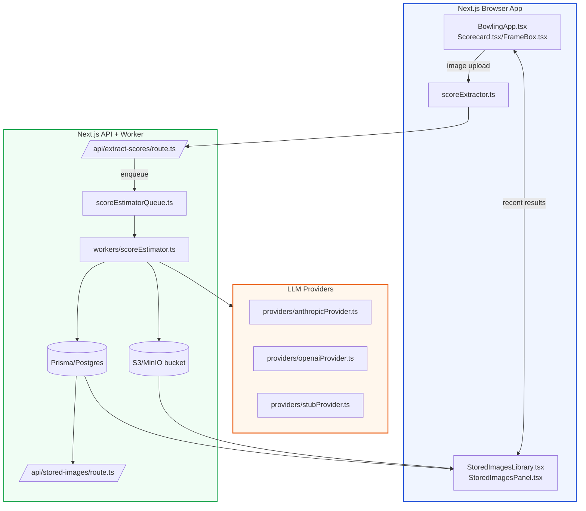

# Bowling Scorecard Vibes — System Diagram

```mermaid
flowchart TD
    subgraph Browser["Next.js Browser App"]
        Upload[BowlingApp.tsx<br/>Scorecard.tsx/FrameBox.tsx]
        Library[StoredImagesLibrary.tsx<br/>StoredImagesPanel.tsx]
        Extractor[scoreExtractor.ts]
    end

    subgraph API["Next.js API + Worker"]
        ExtractRoute[/api/extract-scores/route.ts/]
        StoredImagesRoute[/api/stored-images/route.ts/]
        Queue[scoreEstimatorQueue.ts]
        Worker[workers/scoreEstimator.ts]
        Prisma[(Prisma/Postgres)]
        Storage[(S3/MinIO bucket)]
    end

    subgraph Providers["LLM Providers"]
        Anthropic["providers/anthropicProvider.ts"]
        OpenAI["providers/openaiProvider.ts"]
        Stub["providers/stubProvider.ts"]
    end

    Upload -->|image upload| Extractor --> ExtractRoute
    ExtractRoute -->|enqueue| Queue --> Worker --> Providers
    Worker --> Prisma
    Worker --> Storage
    Prisma --> StoredImagesRoute
    Storage --> Library
    Prisma --> Library
    Upload <-->|recent results| Library

    style Browser fill:#f0f5ff,stroke:#1d4ed8,stroke-width:2px
    style API fill:#f0fdf4,stroke:#16a34a,stroke-width:2px
    style Providers fill:#fff7ed,stroke:#ea580c,stroke-width:2px
```
